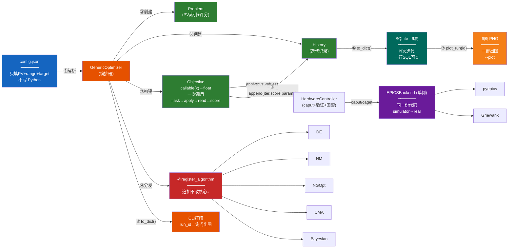

# SXFEL 通用 EPICS 优化工具箱 

通用加速器优化框架，JSON 配置驱动，支持模拟器和真实 EPICS。5 种算法，SQLite 存储，自动可视化。

## 快速开始

```bash
pip install -r requirements.txt

# 模拟器模式（无硬件）
python run_optimization.py --config configs/test_benchmark.json --simulator -y

# 真实 EPICS 模式
python run_optimization.py --config my_config.json
```

## 用户指南

### 第一步：选配置文件

| 如果你要... | 用这个文件 |
|------------|-----------|
| **从零开始写新任务** | [`configs/template.minimal.json`](configs/template.minimal.json) — 复制一份，填 PV 即可 |
| **了解每个字段含义** | [`configs/config_reference.json`](configs/config_reference.json) — 完整参考手册 |
| **看一个已有的轨道示例** | [`configs/orbit_example.json`](configs/orbit_example.json) |
| **看束流尺寸优化示例** | [`configs/beam_example.json`](configs/beam_example.json) |
| **测试算法效果** | [`configs/test_benchmark.json`](configs/test_benchmark.json) — Griewank 10D 基准 |

### 第二步：运行

```bash
# 模拟器调试（不接机器）
python run_optimization.py --config my_config.json --simulator -y

# 确认无误 → 去掉 --simulator 接真实 EPICS
python run_optimization.py --config my_config.json
```

### 第三步：选算法

```bash
# 所有算法统一通过 --algorithm 切换
python run_optimization.py --config my_config.json --simulator -y --algorithm de           # Differential Evolution（默认）
python run_optimization.py --config my_config.json --simulator -y --algorithm nelder-mead  # Nelder-Mead
python run_optimization.py --config my_config.json --simulator -y --algorithm ngopt        # Nevergrad NGOpt（需安装）
python run_optimization.py --config my_config.json --simulator -y --algorithm cma          # Nevergrad CMA（需安装）
python run_optimization.py --config my_config.json --simulator -y --algorithm bayesian     # Bayesian（需 scikit-learn）
```

## 配置结构速览

```jsonc
{
    "variables": [{"pv": "PV:NAME", "range": [-1, 1]}],
    "objectives": {"groups": [{
        "pvs": [{"pv": "PV:TARGET", "target": 0.0}],
        "scoring": {"method": "l2"}
    }]},
    "optimization": {"algorithm": "differential_evolution", "budget": 50}
}
```

详见 [`config_reference.json`](configs/config_reference.json)。

## 架构



> **图例**：数字 ①—⑧ 对应运行时的 8 个步骤。"━━━" 分隔线下是通用性说明。粉色节点 = 无需改核心代码即可扩展。

## CLI

```bash
python run_optimization.py --config config.json                # 基础用法
python run_optimization.py --config config.json -y             # 跳过确认
python run_optimization.py --config config.json --budget 100   # 覆盖迭代次数
python run_optimization.py --config config.json --algorithm de # 覆盖算法
python run_optimization.py --config config.json --simulator    # 模拟器模式
python run_optimization.py --config config.json --plot         # 自动生成图表
```

## 支持

zhangny@sari.ac.cn, zhangbw@sari.ac.cn
