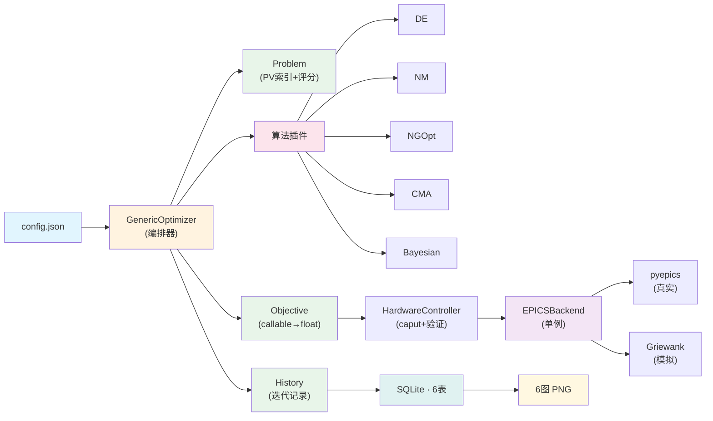

# SXFEL 通用 EPICS 优化工具箱 

通用加速器优化框架，JSON 配置驱动，支持模拟器和真实 EPICS。5 种算法，SQLite 存储，自动可视化。

## 快速开始

```bash
pip install -r requirements.txt

# 模拟器模式（无硬件）
python run_optimization.py --config configs/test_benchmark.json --simulator -y

# 真实 EPICS 模式
python run_optimization.py --config my_config.json
```

## 用户指南

### 第一步：选配置文件

| 如果你要... | 用这个文件 |
|------------|-----------|
| **从零开始写新任务** | [`configs/template.minimal.json`](configs/template.minimal.json) — 复制一份，填 PV 即可 |
| **了解每个字段含义** | [`configs/config_reference.json`](configs/config_reference.json) — 完整参考手册 |
| **看一个已有的轨道示例** | [`configs/orbit_example.json`](configs/orbit_example.json) |
| **看束流尺寸优化示例** | [`configs/beam_example.json`](configs/beam_example.json) |
| **测试算法效果** | [`configs/test_benchmark.json`](configs/test_benchmark.json) — Griewank 10D 基准 |

### 第二步：运行

```bash
# 模拟器调试（不接机器）
python run_optimization.py --config my_config.json --simulator -y

# 确认无误 → 去掉 --simulator 接真实 EPICS
python run_optimization.py --config my_config.json
```

### 第三步：选算法

```bash
# 所有算法统一通过 --algorithm 切换
python run_optimization.py --config my_config.json --simulator -y --algorithm de           # Differential Evolution（默认）
python run_optimization.py --config my_config.json --simulator -y --algorithm nelder-mead  # Nelder-Mead
python run_optimization.py --config my_config.json --simulator -y --algorithm ngopt        # Nevergrad NGOpt（需安装）
python run_optimization.py --config my_config.json --simulator -y --algorithm cma          # Nevergrad CMA（需安装）
python run_optimization.py --config my_config.json --simulator -y --algorithm bayesian     # Bayesian（需 scikit-learn）
```

## 配置结构速览

```jsonc
{
    "variables": [{"pv": "PV:NAME", "range": [-1, 1]}],
    "objectives": {"groups": [{
        "pvs": [{"pv": "PV:TARGET", "target": 0.0}],
        "scoring": {"method": "l2"}
    }]},
    "optimization": {"algorithm": "differential_evolution", "budget": 50}
}
```

详见 [`config_reference.json`](configs/config_reference.json)。

## 架构



### 为什么"通用"

所有可变部分都通过**插件注册表**接入，不改核心代码：

```
                  config.json  ← 用户只填: PV + range + target
                        │
          ┌─────────────┼─────────────┐
          ▼             ▼             ▼
   variables[]   objectives[]    optimization{}
   VariableManager ScoringEngine  AlgorithmRegistry
          │             │             │
          │         @register_   @register_
          │         scorer("l2") algorithm("de")
          │             │             │
          │        ┌────┼────┐   ┌────┼────┐
          │        ▼    ▼    ▼   ▼    ▼    ▼
          │       l1   l2  max  DE   NM  NGOpt ....  ← 无限扩展
          │                      CMA Bayesian "my_algo"
          ▼
   EPICSBackend (单例)  ← 同一份代码跑模拟器和真实机器
          │
    ┌─────┴─────┐
    ▼           ▼
  pyepics   Griewank
 (真实)     (模拟)
```

| 层 | 要扩展什么 | 怎么写 | 改核心文件？ |
|----|-----------|--------|------------|
| **算法** | 新优化策略 | `@register_algorithm("my")` + 一个文件 | ❌ 不改 |
| **评分** | 新评估方式 | `@register_scorer("my")` + 一个文件 | ❌ 不改 |
| **变换** | 新数据预处理 | `@register_transform("my")` + 一个文件 | ❌ 不改 |
| **后端** | 新硬件驱动 | 实现 `caput(pv,val)` / `caget(pv)` | ❌ 不改 |
| **配置** | 新任务 | 一个 JSON 文件 | ❌ 不改 |

### 数据流详解

```
   config.json                    ← 用户填写: variables[], objectives{}, optimization{}, hardware{}
       │
       ▼
   GenericOptimizer.__init__()    ← 解析配置 → 创建 Problem + 初始化 History
       │
       ▼  run() ──────────────────────────────────────────┐
       │                                                   │
       ├─ ① 读取初始值                                     │
       │    var_mgr.read_initial_values() → caget(pvs)     │
       │    Fix: 边界裁剪 (initial ∈ [lo, hi])              │
       │                                                   │
       ├─ ② 初始评估                                       │
       │    caget_many(obj_pvs) → problem.compute_score()  │
       │    → history.add_initial(score, group_scores)    │
       │                                                   │
       ├─ ③ 构建目标函数                                   │
       │    ObjectiveFunction(hw, problem, history, pvs)  │
       │       └─ __call__(x) → 每次迭代:                  │
       │            hw.apply() → caget_many() → score     │
       │            → history.append(...)                  │
       │                                                   │
       ├─ ④ 算法分发                                       │
       │    algo = get_algorithm("de")                    │
       │    algo.run(objective, bounds, budget, history)   │
       │       └─ DE/NM/NGOpt/CMA/Bayesian 统一接口       │
       │                                                   │
       ├─ ⑤ 结果提取                                       │
       │    history.update_best() → best_score, best_params │
       │                                                   │
       └─ ⑥ 持久化 + 可视化                                │
            history.to_dict() → save_results() → SQLite    │
            → "Generate plot?" → plot_run(run_id) → PNG   │
```

## CLI

```bash
python run_optimization.py --config config.json                # 基础用法
python run_optimization.py --config config.json -y             # 跳过确认
python run_optimization.py --config config.json --budget 100   # 覆盖迭代次数
python run_optimization.py --config config.json --algorithm de # 覆盖算法
python run_optimization.py --config config.json --simulator    # 模拟器模式
python run_optimization.py --config config.json --plot         # 自动生成图表
```

## 支持

zhangny@sari.ac.cn, zhangbw@sari.ac.cn
